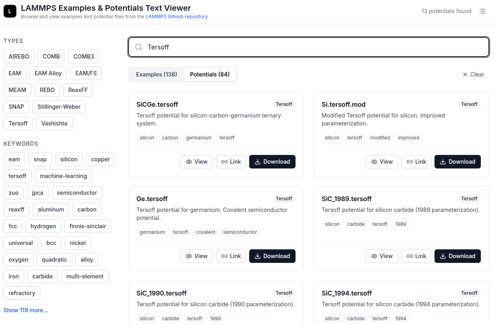

# LAMMPS Examples & Potentials Text Viewer
[](https://stefanbringuier.github.io/lammps-examples-potentials-viewer/)
[](https://github.com/stefanbringuier/lammps-examples-potentials-viewer/actions/workflows/deploy.yml) [](https://github.com/stefanbringuier/lammps-examples-potentials-viewer/actions/workflows/ci.yml)

A simple, curated [web interface](https://stefanbringuier.github.io/lammps-examples-potentials-viewer/) for browsing and viewing [LAMMPS](https://lammps.org) example files and potential files from the repo.

## What it does

This is **just** a LAMMPS example and potential folder text browser/viewer/downloader - nothing more. It's designed for those who work across multiple computing environments and don't want to keep hunting for specific LAMMPS example or potentials files across different git pulls and github tree.

The viewer provides:
- **Search and filter** 
- **In-browser text viewing** 
- **Direct links** 
- **Download functionality** 

## What it doesn't do

- No advanced fuzzy search
- No automatic updates from the LAMMPS repo
- No rich descriptions




## Contributing

### Adding New Entries

Want to add a new example or potential? Great! Here's how:

1. **Fork this repository**
2. **Edit the data file**: To add an example, edit `data/examples.js`. To add a potential, edit `data/potentials.js`.
3. **Add your entry** to the `exampleEntries` or `potentialEntries` array, following the existing format. Make sure to define the `BASE_GITHUB_URL` if it's not already present at the top of the file.

For examples:
```js
{
  id: "unique-id",
  name: "Display Name",
  category: "category-name",
  description: "Detailed description of what this example demonstrates",
  path: "examples/folder-name", // relative to LAMMPS repo root
  files: ["in.filename", "data.filename"], // list of files in the folder
  keywords: ["keyword1", "keyword2", "keyword3"],
  gitHubUrl: "URL_OR_REPO_TO_FOLDER"
}
```

For potentials:
```js
{
  id: "unique-id",
  name: "filename.ext",
  type: "Potential Type",
  description: "Description of the potential and what systems it models",
  elements: ["Element1", "Element2"],
  path: "potentials/filename.ext", // relative to LAMMPS repo root
  files: ["filename.ext", "anotherfile.ext"], // list of one or more files
  keywords: ["keyword1", "keyword2"],
  gitHubUrl: "URL_TO_REPO_TO_FILE"
}
```

4. **Submit a Pull Request** with your changes


## Development

```bash
npm install
npm run dev
npm run build
```

## License

This project is licensed under the GNU General Public License v2.0. See the [LICENSE](LICENSE) file for details.
